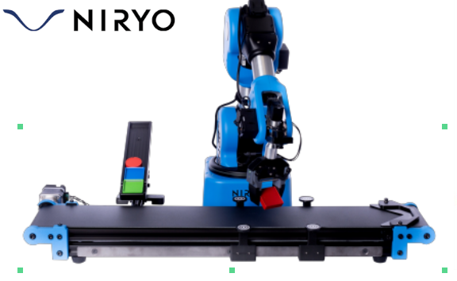
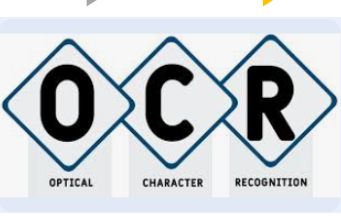
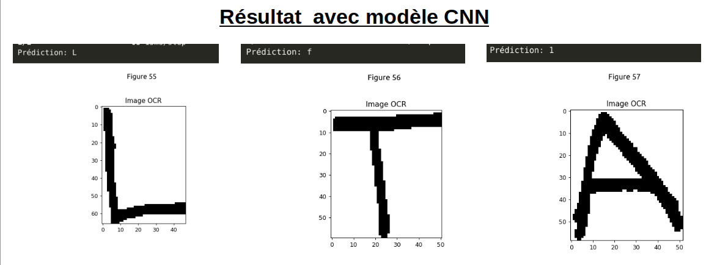
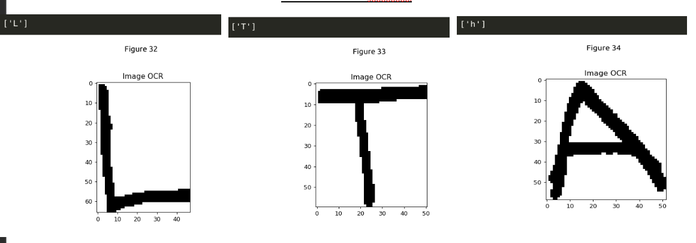

# Projet de Contrôle de Robot avec Détection de Caractères

Ce projet vise à contrôler les mouvements d'un robot en Python tout en intégrant une détection de caractères à l'aide de techniques de reconnaissance optique de caractères (OCR) au Robot. 
Deux approches pour la détection de caractères sont comparées : un modèle SVM et PyTesseract d'une part, et un modèle CNN avec PyTesseract d'autre part.
Cependant ajout de la detection Texte  n'as pus etre  ajouter au commande du robot 
ce sera la prochaine evolution du projet

 

## Credits

- [Anis BERGUIGUA]
- [Brian LY]

## Contenu du Projet

- `vision.py`: Script Python pour controler le robot niryo pour le tri des pieces en 
- `ocr.ipynb`: Implémentation de la détection de caractères avec un modèle CNN.
- `ocr_2.ipynb`: Implémentation de la détection de caractères avec un modèle SVM.
- `alpabet_resize/`: Répertoire contenant les données d'entraînement et de test pour les modèles OCR. avec des tailles      d'images modifiés
- `alpabet/`: Répertoire contenant les données d'entraînement et de test pour les modèles OCR.
- `requirements.txt`: Liste des dépendances Python nécessaires pour exécuter le projet.

## requirements
dans ce projet il faut installer les librairies suivante:

pip install numpy tensorflow scikit-learn opencv-python matplotlib pytesseract

## Tests

voici les resultat du modele en utilisant le modele CNN

en utilisant SVM

